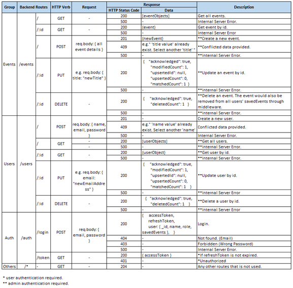
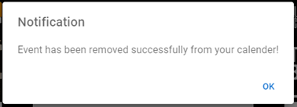

# WATch! (Events Tracker)

This is a MERN full stack web application created for General Assembly's SEIF (Software Engineering Immersive Flex) Bootcamp Program. It's a group of 2 project. This is backend portion of web app; frontend portion can be found [here](https://github.com/SerenaFoo2/event-tracker-frontend).

WATch! (also refers to Watch WAT!) is a platform that list all events that is happening around you. Logged in user can track their favourite events by adding or removing them from their calendar. With admin access, event can be created, modified or removed from the platform.

## Tech Stack / Libraries

These are tools used in this project.

Frontend:

- [React](https://reactjs.org/)
- [React Router](https://reactrouter.com/en/main)
- [React Redux](https://react-redux.js.org/)
- [Material UI](https://mui.com/material-ui/getting-started/overview/)
- [Axios](https://axios-http.com/)
- [Full Calender](https://fullcalendar.io/)

Backend:

- [Node.js](https://nodejs.org/en/)
- [Express](https://expressjs.com/)
- [Mongoose](https://mongoosejs.com/)
- [jsonwebtoken](https://jwt.io/)
- [http-status](https://www.npmjs.com/package/http-status)
- [bcrypt](https://www.npmjs.com/package/bcrypt)
- [cors](https://www.npmjs.com/package/cors)
- [dotenv](https://www.npmjs.com/package/dotenv)

Database:

- [MongoDB](https://www.mongodb.com/home)

Application Hosting:

- frontend is hosted at [vercel](https://event-tracker-frontend.vercel.app/).

- backend is hosted at [cyclic](https://event-tracker-backend.cyclic.app/).

### Installation Instructions:

Frontend:

1. Clone frontend repo.
2. Install all required libraries using `npm install` if you are using node package manager.
3. Create a `.env` file in the root of your project. Inside the file add the following:
   ```
   REACT_APP_API_URL=http://localhost:4000
   SECRET_KEY="YOURSECRETKEYGOESHERE"
   ```
4. `npm start` to launch application.

Backend:

1. Clone backend repo.
2. Install all required libraries using `npm install` if you are using node package manager.
3. Create a `.env` file in the root of your project. Inside the file add the following:

   ```

   # Secret tokens for JWT
   ACCESS_TOKEN_SECRET=YOURSECRETKEYFORACCESSTOKEN
   REFRESH_TOKEN_SECRET=YOURSECRETKEYFORREFRESHTOKEN

   # indicate in seconds.
   REFRESH_TOKEN_LIFESPAN=ANYNUMERICALVALUEBIGGER e.g. 3600
   ACCESS_TOKEN_LIFESPAN=ANYNUMERICALVALUEBIGGER e.g. 300

   # Uncomment this if you are not connected to default mongodb
   # database, "mongodb://localhost:27017/project3Database".
   # MONGO_URI=YOURDATABASEURL

   ```

4. `npm run dev` to launch application if you have nodemon installed globally; else use `npm run start`.

## Project Description

### Requirements/Inputs Gathering:

1. **User stories** were developed in early project stage to describe important features to be included in the project.

   - User Story 1: : As someone who is busy and like to attend events, I would like to browse all events in one place and add my favourite events that is viewable in calendar.

   - User Story 2: As a user, I would like to have a carousel showing "highlighted" events.

   - User Story 3: As an admin of the application, I would like to make changes to the database so that the application can continue to provide relevant content to the users.

2. Translation of user stories into **Main Features** that our web application should have:

   - Carousel to display "highlighted" events.

   - Display all events with key details.
   - Modal to show full event details, when click on carousel or event card.
   - Form to create a new user account and login.
   - Function for user to add favourite events into their calendar.
   - A calendar to display all users’ favourite events.
   - Admin access to create, remove, or update events.
   - Data persisted in database.
   - Authentication to access protected APIs routes.
   - Authorization access for different roles (admin and user).

3. **Wireframes** were developed to facilitate visualization.

   Home Page

   

   My Events page

   

   Login Page

   

   Create Account Page

   

   MongoDB Event Model

   

   MongoDB User Model

   

   API Routes

   

### Features:

Home Page (Top Half Page)


- Navigation Bar
  - In "admin" access, "Admin Mode" will show up.
  - In "user" access, greetings message like "Hello, john" will show up.
- Carousel
  - Images of events with "is_featured" set to true will show up and auto slides in infinite loop.
  - Click on image will show up "Full Event Details Modal".
- Featured Events

  - All events are displayed in event card with key details.
  - Click on "LEARN MORE" will show up "Full Event Details Modal".

    Full Event Details Modal

    

Home Page (Bottom Half Page)


- Featured Events

  - In "user" access, favourite "love" icon will show up. User can toggle to add or remove event. Confirmation and notication modals will appear before and after processing is done. These modals are applicable to all events related buttons.

    Confirmation modals:

    
    

    Notification modals:

    
    

- Footer

My Events Page (Month View)


- Calendar App

  - Multiple calendar viewing format (month, week, day, list).

    Calendar - Week View

    

    Calendar - Day View

    

    Calendar - List View

    

  - In "admin" access:

    - All events will be displayed here.
    - Click and drag event is allowed to update event date/time.
    - Click on "Add Event" button would show up a Create New Event form.

      

    - Click on any existing event to delete event. If event is deleted, the same event favourited by user would be deleted too.

  - In "user" access:
    - Only favorited events will be displayed here.
    - Click on any favorited event to unfovorite.

Login Page


Create Account Page


JWT Authentication:

- Authentication is done at backend using JWT access token.
- Upon login, access and refresh tokens will be issued. These tokens are then stored in "state" of frontend app.
- Every request made to protected APIs require access token which is stored in Authorization Header of request object in "bearer token" format.
- Typically, access token has much shorter life span than refresh token. If expired, refresh token can be used to get new access token. If refresh token is expired, access to protected APIs would be forbidden and relogin is required.
- With Axios request interceptor, before any request to protected APIs is sent, interception is made to check the expiration of access token. If expired, new access token would be obtained using refresh token. Subsequently, request to protected APIs is sent with new access token. All these process are done using the same instance of Axios.

### Area of Improvement:

- Web app to be responsive e.g. mobile, tablet etc.
- Allow user to reset password.
- Add search bar, event filtering and sorting bar.
- Allow user to add review or comments to every event.
- Expand more functions like allow to buy tickets.
- Allow user to submit new events for Admin to review.
